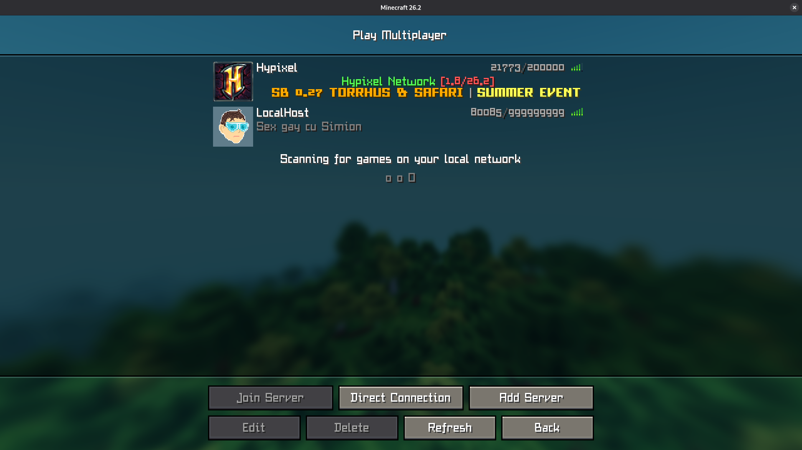

# minegopher

Minegopher is a collection of tools that can be used to make a custom minecraft server from scratch.

I will also want to build a server that actually works and is playable with this project.

## Project walkthrough:
    - cmd/ (entry points for binaries)
    - examples/
    - internal/ (private implementation details)
    - pkg/ (public packages)
        - lanmulticast (udp multicast for LAN connection)
        - mcproto (minecraft protocol packets)
        - mctypes (minecraft protocol types, ex: varint)
    - test (tests and test assets)

